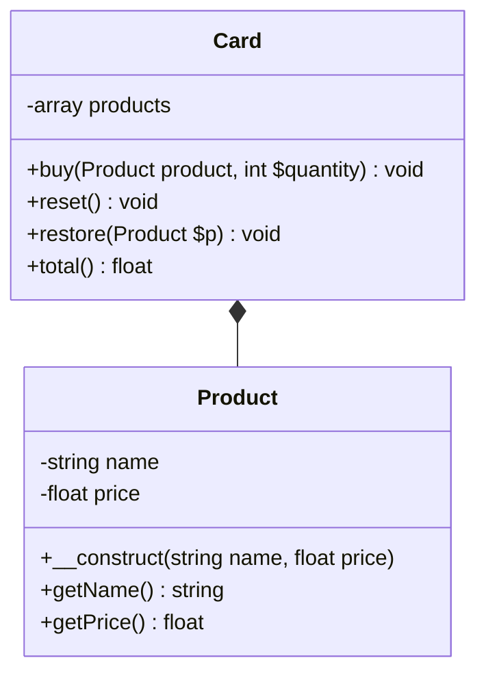

# Introduction & Présentation des tests unitaires

Nous allons aborder les tests unitaires de manière direct dans le code déjà écrit. Nous verrons plus tard une autre manière de procéder que l'on appelle TDD ,Tests Driven Developpment, qui consiste à créer des tests avant même d'implémenter la logique métier dans les classes de l'application.

Les tests unitaires vont vous aider à identifier et corriger les bugs, à refactorer le code et écrire de une documentation précise sur les fonctionnalités de vos méthodes. Les tests unitaires doivent couvrir toutes les possibilités algorithmiques d'un programme. Chaque test unitaire test une logique d'une méthode spécifique.

Nous verrons également qu'il existe des dépendances logiques entre les tests, des scénarios de tests, mais que les tests eux-mêmes sont isolés.

Retenez chaque test est une méthode qui est isolée des autres tests (méthodes) dans une classe de test.

Une application est bien testée si les tests unitaires couvrent 80% de la logique métier. Dans ce cas l'application a peu de chance de produire des bugs en production et également pourra facilement être étendue avec des nouvelles fonctionnalités, bien sûr on doit si l'application évolue refaire des tests.

**Martin Fowler:**

Concepteur et auteur conférencier informaticien britanique, pionnier et une référence dans la programmation agile.

"A chaque fois que vous avez la tentation de saisir quelque chose dans une instruction print ou dans une expression de débogage, écrivez le plutôt dans un test."

## Installation

Vous devez avoir une version de PHP >= 7.4

On va installer **PHPUnit** qui est un framework de tests. Nous pouvons l'installer de manière globale, c'est-à-dire 
dans le dossier /usr/local/bin de notre machine ou alors, l'installer uniquement pour le projet en cours.

  ```bash
composer search phpunit
composer show phpunit/phpunit --all 

# Installation locale
composer require --dev phpunit/phpunit

# Installation globale
composer global require phpunit/phpunit
```

Une autre manière installer phpunit est d'installer l'exécutable :

```bash
wget -O phpunit https://phar.phpunit.de/phpunit-9.phar
chmod +x phpunit
./phpunit --version

# Déplacez l'exécutable dans le dossier /usr/local/bin
```

## Application d'application configuration

On teste la logique algorithmique d'une classe, chaque test est une méthode d'une classe de test. Les tests sont isolés les uns des autres, principes d'isolation des tests.

Les convetions de nommage des tests sont :

- Pour une classe : **NameClasseTest** et pour un test (méthode) **testNameMethod** (mot clé test suivi du nom de la méthode à tester en général).

**Configuration**

1. Créez un dossier **src** et **tests** dans le dossier Messages dans le dossier Examples à l'aide de la commande composer init.

2. Initialisez le projet avec la commande suivante

```bash
composer init
```

Dans le fichier composer.json écrivez le code suivant, la classe Message sera dans le namespace App :

```json
{
    "name": "alan/messages",
    "autoload": {
        "psr-4": {
            "App\\Message\\": "src/"
        },
        "classmap": [
            "src/"
        ]
    },
    "authors": [
        {
            "name": "Alan",
            "email": "alan@alan.com"
        }
    ],
    "require": {}
}
```

à la racine du dossier Messages nous allons placer un fichier de configuration pour phpunit, créez ce fichier et mettez le code suivant, on définit un fichier **bootstrap.php** de bootstrap à la racine du dossier de tests. 

## La méthode setUp et tearDown

La méthode **setUp** dans la classe MessageTest est appelée en premier avant tous les autres tests, et est appelée avant chaque test.

Nous n'implémentons pas la méthode **tearDown**, elle est utile si la méthode **setUp** alloue des ressources externes comme l'ouverture de fichiers ou base de données. Elle permettra dans ce cas de fermer ces ressources.

Rappel : une classe tests est basée sur l'isolation, en terme de propriétés définies dans la classe de test, de chaque test. Chaque test repart avec ces propriété ré-initialisée.

```xml
<?xml version="1.0" encoding="UTF-8"?>
<phpunit bootstrap="tests/bootstrap.php"
         colors="true">
    <testsuites>
        <testsuite name="Message">
            <directory>./tests</directory>
        </testsuite>
    </testsuites>
</phpunit>
```

Le fichier de autoload.php contiendra le code suivant dans un premier temps.

```php
require_once __DIR__.'/../vendor/autoload.php';
```

## 01 Exercice Message - exercice guidé

```php

use PHPUnit\Framework\TestCase;
use App\Message;

class MessageTest extends TestCase{

    protected Message $message;


    public function setUp():void{
        $this->message = new Message('en');
    }

    public function testOne(){

        $this->assertSame("Hello World!",$this->message->get());
    }
}
```

On vous donne la classe métier à tester:

```php
namespace App;

class Message
{

    public function __construct(
        private string $lang = 'en',  
        private array $translates = ['fr' => 'Bonjour les gesn!', 'en' => 'Hello World!']
        )
    {
    }

    public function get(): string
    {

         return $this->translates[$this->lang];
    }

    public function setLang(string $lang): void
    {
        $this->lang = $lang;
    }
}
```

Lancez maintenant le test suivant en console à la racine du dossier Message:

```bash
vendor/bin/phpunit
```

Vous pouvez modifier le fichier `composer.json` pour lancer les tests en une commande composer comme suit:

```json
"scripts": {
    "test": "vendor/bin/phpunit"
}
```

Indication : si tous les tests sont bons alors, ils seront verts.

1. Créez la classe Message et test la classe, les messages en français puis en anglais en changeant la langue.

2. Créez une méthode qui inverse les phrases en français puis en anglais.

## Configuration des tests fournisseurs de données et exceptions

Nous pouvons allez plus loin dans la configuration des tests, pour bien comprendre le framework de tests nous allons présenter d'autres techniques. Nous pouvons en effet fournir aux tests des valeurs arbitraires.

Un fournisseur de tests devra être une méthode publique et retourner soit un tableau, soit un objet qui implémente une interface Iterator. 

On utilise 

```php
use PHPUnit\Framework\Attributes\DataProvider;
use PHPUnit\Framework\TestCase;

final class NumericDataSetsTest extends TestCase
{
    public static function additionProvider(): array
    {
        return [
            [0, 0, 0],
            [0, 1, 1],
            [1, 0, 1],
            [1, 1, 3],
        ];
    }

    #[DataProvider('additionProvider')]
    public function testAdd(int $a, int $b, int $expected): void
    {
        $this->assertSame($expected, $a + $b);
    }
}
```

## Les exceptions

Vous pouvez également tester les exceptions, et même le type d'exception que votre code métier retourne :

```php
use PHPUnit\Framework\TestCase;

class ExceptionTest extends TestCase
{
    public function testException()
    {
        $this->expectException(InvalidArgumentException::class);
        $this->model->save($user); // $user n'est pas, par exemple, un argument attenu, nauvais type, et dans la méthode save on lève dans ce cas une exception 
    }
}
```

## 02 Exercice Calculator

Écrire des tests unitaires pour une classe `Calculator` utilisant PHPUnit. 
La classe `Calculator` permet d'effectuer des opérations mathématiques simples comme l'addition et la division.

1. **Installer PHPUnit :** Assurez-vous que PHPUnit est installé et configuré sur votre environnement de développement.

2. **Classe `Calculator` :** Vous avez une classe `Calculator` avec les méthodes suivantes :
   - `__construct($precision)`: Constructeur initialisant la précision.
   - `getPrecision()`: Renvoie la précision actuelle.
   - `add($a, $b)`: Additionne deux nombres.
   - `division($a, $b)`: Divise `$a` par `$b`.

2. Écrivez des tests pour vérifier que le constructeur initialise correctement la précision de la calculatrice.
   
3. Écrivez un test pour vérifier que l'instance créée est bien une instance de la classe `Calculator`.
   
4. Utilisez un DataProvider pour écrire des tests pour la méthode `add` de la classe `Calculator`. Le DataProvider doit fournir plusieurs ensembles de données pour tester différents cas d'addition (nombres positifs, négatifs, décimaux, etc.).

5. Écrivez un test pour vérifier que la méthode `division` lance une exception de type `DivisionByZeroError` lorsque le diviseur est zéro.
   
6. Écrivez un test pour vérifier que la méthode `division` lance une exception avec le message approprié "Impossible de diviser par zéro" lorsque le diviseur est zéro.


## 03 Exercice Card 

Vous devez implémenter le code métier des classes suivantes.

- Product
- Card 



Créez une classe avec ou sans implémenter le code métier ( approche TDD).

Pour tester la classe `Card` et ses fonctionnalités, voici une série de questions que vous pourriez poser lors de la construction des tests :

1. **Test d'ajout d'un produit unique (`testBuySingleProduct`)** :
   - **Contexte**: Qu'advient-il lorsque j'ajoute un produit unique au panier ?
   - **Conditions initiales**: Le panier est vide.
   - **Action**: J'ajoute deux unités du produit A (prix 10.0 chacun).
   - **Résultat attendu**: Le total du panier devrait être 20.0.

2. **Test d'ajout de produits existants (`testBuyExistingProduct`)** :
   - Que se passe-t-il lorsque j'ajoute plusieurs quantités de produits existants au panier ?
   - Le panier est vide.
   - **Actions**: 
     - J'ajoute deux unités du produit A (prix 10.0 chacun).
     - J'ajoute une unité du produit B (prix 5.0).
     - J'ajoute une unité supplémentaire du produit A.
   - **Résultat attendu**: Le total du panier devrait être 35.0.

3. **Test de réinitialisation du panier (`testResetCard`)** :
   - Comment le panier réagit-il à une réinitialisation complète ?
   - Le panier contient deux unités du produit A.
   - **Action**: Je réinitialise le panier.
   - **Résultat attendu**: Le total du panier devrait être 0.0 après la réinitialisation.

4. **Test de restauration du panier à un état précédent (`testRestoreCard`)** :
   - Comment le panier restaure-t-il son état après une sauvegarde ?
   - Le panier contient deux unités du produit A et une unité du produit B.
   - **Actions**: 
     - Je sauvegarde l'état actuel du panier.
     - J'ajoute une unité supplémentaire du produit B.
     - Je restaure le panier à son état précédent.
   - **Résultats attendus**: 
     - Après la sauvegarde, le total du panier est 25.0.
     - Après restauration, le total du panier devrait être 20.0.
